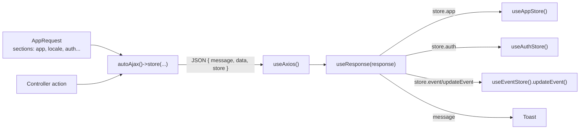

Every application we build has the same shape: a Laravel backend running CrudAdmin, and one or more frontends (a Nuxt website, an Ionic + Capacitor mobile app, a Vue SPA) talking to it over JSON. This tab describes that shape, so every project is built the same way and a developer, or an AI agent, moving between projects finds the same structure everywhere.

## The main pillar: `@crudadmin/helpers`

The frontends never talk to the backend with a bare `fetch` or their own axios setup. They use the `@crudadmin/helpers` npm package. It is the single layer through which an application communicates with CrudAdmin:

- an axios wrapper adding the auth token, the language and the platform headers to every request,
- `Response`, which shows the message of a response as a toast and **binds the `store` object of the response into Pinia stores**,
- one bootstrap request filling the stores when the app starts, and refreshing them,
- auth (login, logout, token storage), modals, toasts, gettext translations and localized routes.

The CrudAdmin administration itself is built on the same package: it boots from `GET /admin/api/bootstrap`, binds the `store` object into its Pinia stores through `Response` and uses `Modal`, `Toast` and the translator of `@crudadmin/helpers`. See [Admin Vue API](/admin/frontend/vue).

## How data travels

1. The backend puts shared data into **sections** of a bootstrap request class (`AppRequest`). Each section is named after the Pinia store which receives it.
2. A controller answers with `autoAjax()`. Whatever it puts into `->store([...])` ends in the `store` key of the JSON.
3. The frontend calls the API through `useAxios()` and hands every response, success or error, to `useResponse()`.
4. `Response` writes each key of `store` into the store with the same id, and shows `message` as a toast.

A frontend component therefore rarely copies response data into state by hand. It reads the stores, and the backend decides what the stores contain.

## Where to read next

<Columns cols={2}>
  <Card title="Sharing data with the frontend" icon="arrow-right-left" href="/development/communication">
    The response format, the store binding rules and the controller patterns. Start here.
  </Card>
  <Card title="Bootstrap request" icon="rocket" href="/development/bootstrap">
    The backend side: `AppRequest`, its sections, guests, caching and several apps.
  </Card>
  <Card title="@crudadmin/helpers" icon="package" href="/development/frontend/index">
    Installing the package as a Nuxt layer or in a Vite app.
  </Card>
  <Card title="App boot and auth" icon="power" href="/development/frontend/boot">
    The bootstrap, its refresh, the auth token and the hooks of the Nuxt layer.
  </Card>
  <Card title="Requests and responses" icon="send" href="/development/frontend/requests">
    `useAxios()`, `useResponse()`, headers and offline requests.
  </Card>
  <Card title="Pinia stores" icon="database" href="/development/frontend/stores">
    Which stores receive data, the helpers stores and extending them.
  </Card>
</Columns>

## Rules shared by every project

- Every frontend request goes through `useAxios()` from `@crudadmin/helpers`, and every response through `useResponse()`.
- Data shared by the whole app comes from the bootstrap request, not from page specific endpoints.
- A section of the bootstrap and the Pinia store receiving it have the same name, in the singular: `event`, `setting`, `auth`.
- A controller changing shared data returns the changed sections (`AppRequest::only(['auth'])`) or calls a store action (`'event/updateEvent' => $event`) instead of returning data the component copies into a store by hand.
- `config/autoajax.php` sets `'store' => true`, so store data arrives under the `store` key.
